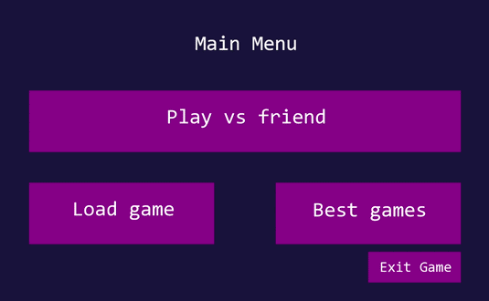

<h1 align="center">Hexxagon Clone ⬢</h1>

<div align="center">
  
</div>

<br>

A 2D local-multiplayer clone of the classic DOS strategy game, focused on memory management and data persistence.

### Key Features
* **Tactical 1v1 PvP:** Classic turn-based gameplay on a hexagonal grid.
* **Session Management:** Save, serialize, and load active board states and timers.
* **Persistent Leaderboards:** Local file I/O to track high scores and fastest times.

### 🚀 Quick Start
Ensure SFML is installed on your machine, then compile:
```bash
cmake . && make
./hexxagon
